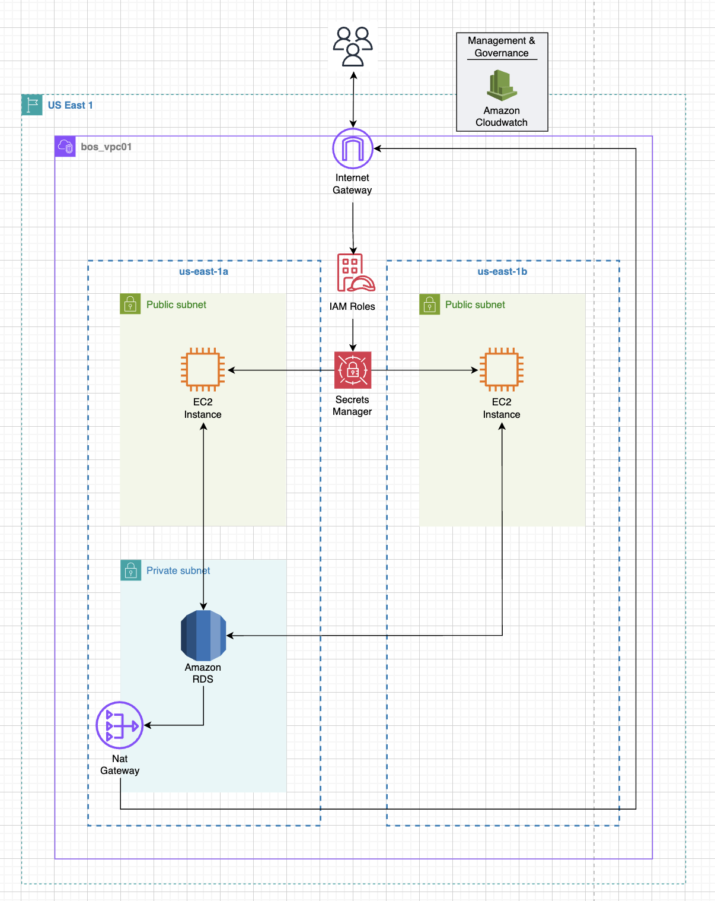

# 🚀 Armageddon AWS Project (Portfolio Implementation)

## 🏗️ Architecture Diagram


## 📌 Project Overview
This project demonstrates the design and implementation of a **production-style AWS cloud architecture** built using Infrastructure as Code (Terraform).

The system evolves across three phases, progressing from a basic deployment to a **secure, scalable, and globally distributed architecture**, with performance optimizations implemented using **Amazon CloudFront (CDN caching)**.

## 🧱 Architecture Evolution

### 🏗️ Phase 1 — Baseline Infrastructure

Built core AWS environment using Terraform.

**Deployed:**
- VPC with public and private subnets
- EC2 instances
- RDS (MySQL)
- IAM roles

Established initial application connectivity and monitoring.

👉 **Outcome:** Functional cloud environment with basic networking and compute.

👉 Outcome: Functional cloud environment with basic networking and compute

### 🔒 Phase 2 — Secure Private Architecture

Enhanced the baseline architecture by introducing private networking and stronger security controls.

**Implemented:**
- Migration of compute resources into private subnets
- NAT Gateway for controlled outbound internet access
- VPC Interface Endpoints (PrivateLink) for secure service communication
- AWS Secrets Manager for secure credential storage
- IAM policies following the principle of least privilege

👉 **Outcome:** Production-style security posture with reduced attack surface and controlled access to critical resources.

---

### 🌎 Phase 3 — Global & Scalable Architecture

Extended the architecture across multiple regions to support high availability and compliance requirements.

**Implemented:**
- Multi-region deployment strategy
- AWS Transit Gateway for inter-region connectivity
- Regional segmentation for fault isolation
- Compliance-focused architecture patterns for data residency

👉 **Outcome:** Highly available, globally distributed infrastructure capable of supporting enterprise-scale workloads.

---

## ⚡ Performance Optimization (My Contribution)

### 🌐 CloudFront Integration

Implemented **Amazon CloudFront** as a CDN layer to improve performance and scalability.

**Key Improvements:**
- Configured caching behavior to reduce latency
- Accelerated content delivery for end users
- Reduced load on backend infrastructure (EC2/RDS)

👉 **Outcome:**
- Faster response times
- Improved scalability under load
- Reduced infrastructure cost through caching efficiency

---

## 🔐 Security Implementation

- AWS Secrets Manager for centralized credential storage
- IAM roles configured with least-privilege access
- Private subnets for backend resources
- VPC endpoints to eliminate unnecessary public exposure
- Removal of hardcoded credentials from infrastructure code

---

## ⚙️ Tech Stack

- **Cloud:** AWS (VPC, EC2, RDS, CloudFront, ALB, IAM, Secrets Manager, SNS, Transit Gateway)
- **Infrastructure as Code:** Terraform
- **Operating System:** Amazon Linux 2023
- **Scripting & Automation:** Python
- **Networking:** DNS, HTTP/HTTPS, TLS

---

## 📊 What This Project Demonstrates

- Infrastructure as Code (Terraform)
- Secure cloud architecture design
- Multi-tier networking (public/private segmentation)
- Secrets management and IAM best practices
- CDN integration and performance optimization
- Multi-region architecture design

---

## 💼 Business Impact

This architecture demonstrates how modern cloud systems are designed to:

- Improve application performance using CDN caching (CloudFront)
- Secure sensitive data through centralized secrets management
- Reduce attack surface via private networking and VPC endpoints
- Scale globally while maintaining compliance and regional isolation

These patterns are commonly used in production environments to balance performance, security, and cost efficiency.

---

## 📁 Repository Structure

- `tokyo/` — regional infrastructure deployment
- `saopaulo/` — secondary region for failover and compliance
- `lambda/` — automation and reporting functions
- `python/` — validation and operational scripts
- `lab3a_tgw/` — transit gateway and global networking configuration

---

## 🧪 How to Deploy

```bash
terraform init
terraform plan
terraform apply